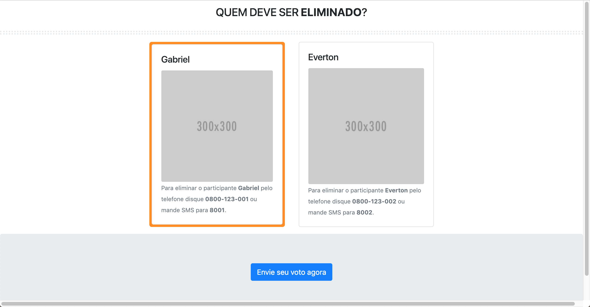
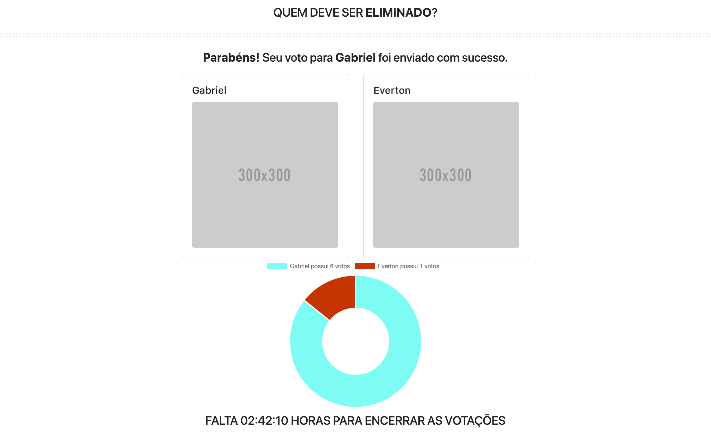

# Quick-Start Guide

- [Installation](#installation)
- [Development Workflow](#development-workflow)

### No boilerplate was used. It was necessary to configure the project manually.
### this project contains: Docker, Nginx, MongoDB, Node, Express, Webpack, GraphQL and React.

## Screen

Screen to VOTE -> scenario 1 selected

Screen to VOTE -> scenario 2 not selected

Screen to see RESULT -> scenario 1

## Installation

**Clone this repo:**

```bash
$ git clone git@github.com:SelecaoGlobocom/Lysandro_Braga.git
$ cd Lysandro_Braga
```

**Install Docker (not required at dev env):**

Linux
```bash
$ sudo apt-get install git -y
$ wget -O - https://gist.githubusercontent.com/wdullaer/f1af16bd7e970389bad3/raw/install.sh | bash
$ service docker start
```

macOs
```bash
brew cask install git
brew cask install docker
```

## Development Workflow

**Start a development server**

```bash
$ npm start
```
> You need to run MongoDB at 27017

> Frontend runs at http://localhost:8080/

> Backend runs at http://localhost:3001/

**Deploy to a container**
```bash
$ sudo docker-compose build
$ sudo docker-compose up
```
or
```bash
$ npm run docker
```
> This deploy the app to a container that runs mongodb, nodejs and nginx

## Decisions
> I decided to create an endpoint with graphql to transfer only necessary data, this is useful when the user are using 3G connections. Graphql creates a modeling of data (this is like a swagger, but more sophisticated) used by application, because that apis in expressjs was deprecated.

## What I did
> Created all crud api methods for Participante e Paredao
> Created all crud graphql mutations/query for Participante e Paredao
> Created containers to scale separate part of application

## TODO
> I neeed to upload the images to cloudinary and add the link to a document, from there we will load the images from SaaS.
> Do script to insert all data to vote rapidly

## License

MIT